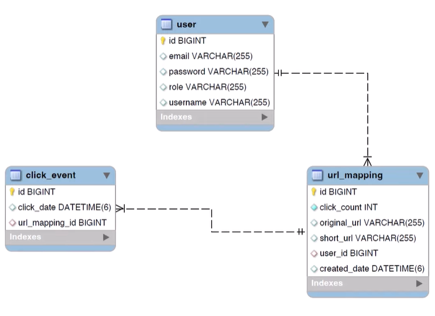

## Database Schema (ER Diagram)

This project uses a relational database schema to store user accounts, URL mappings, and click analytics.

  

### Entities & Relationships
**user:**	Stores user credentials and role-based access. One user can create multiple short URLs. 
**url_mapping:**	Stores original → short URL mapping, creation timestamp, and owner reference. 
**click_event:**	Tracks each URL click with timestamp for analytics (count, usage patterns).

### Relationships Description

**One-to-Many:** A user can create many url_mapping entries → linked via user_id 
**One-to-Many:** A url_mapping can have many click_event entries → linked via url_mapping_id